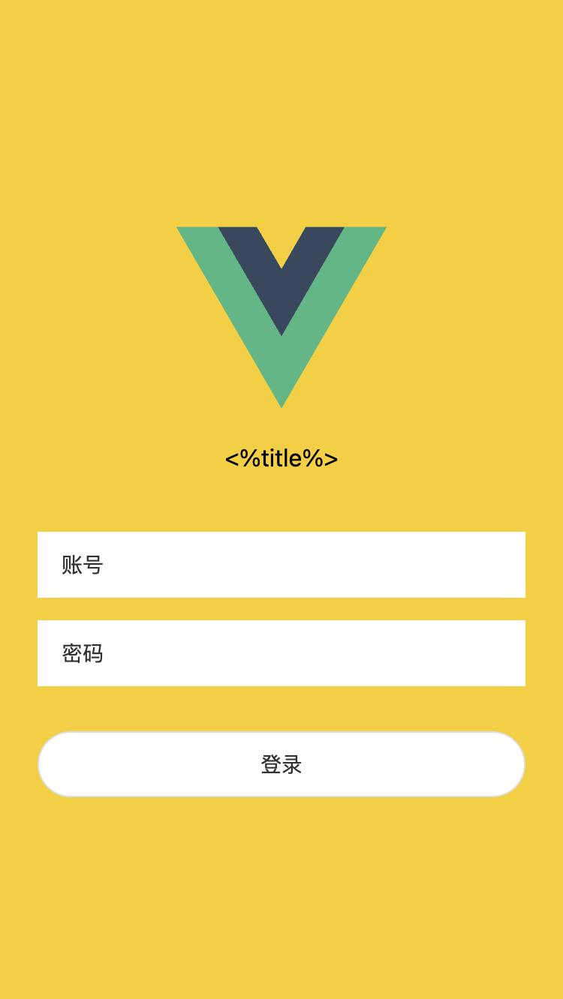

# 基础脚手架

一个基于vue3的初始化模版项目，可结合[https://github.com/hyy22/ksbl-cli](https://github.com/hyy22/ksbl-cli)工具使用。根据分支集成不同ui库模版，目前已集成[element-plus后台管理模版](https://github.com/hyy22/vue3-ts-starter/tree/element-plus)、[vantUI模版](https://github.com/hyy22/vue3-ts-starter/tree/vant)

## 功能

### 语法风格&构建

- [x] eslint+prettier 语法和风格校验
- [x] husky+commitlint+lint-staged git钩子操作
- [x] 支持tailwind css

### 运行时

- [x] vue-router+pinia 路由和状态管理
- [x] axios封装http操作
- [x] 一些公共方法&类型
- [x] fontawesome图标
- [x] iconfont脚本
- [x] 权限控制
- [x] 内置组件

## 使用

```bash
# 安装
yarn # npm install
# 初始化
yarn prepare # npm run prepare
# 开发
yarn dev # npm run dev
# 打包
yarn build # npm run build
# 预览
yarn preview # npm run preview
```

## 结合cli工具使用

```bash
# 安装
npm i ksbl-cli -g
# 设置模版，#xxx用来指定分支名，可以用来切换不同模版
ksbl-cli template set vue3-ts-template git@github.com:hyy22/vue3-ts-starter.git#main
# 初始化项目 可以使用-I选项初始化git -i安装依赖 -m修改包管理工具，默认npm
ksbl-cli create -t vue3-ts-template xxx-web
```

## element-plus模版说明

- [x] element-plus接入
- [x] layout，支持多tab、keep-alive
- [x] 权限控制
- [x] 状态管理
- [x] 常用组件封装
- [x] 常用工具函数

